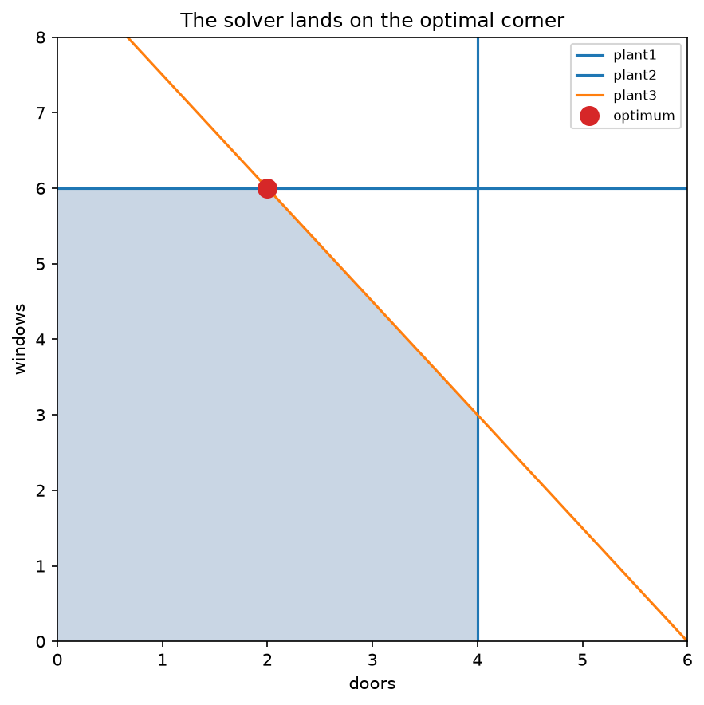
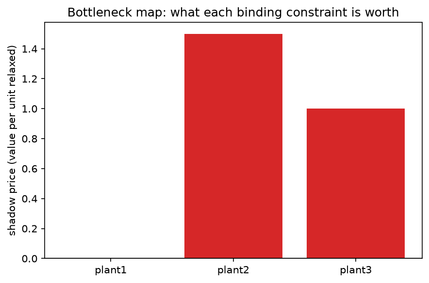

# optimization_101

> **Your business problem is a set of equations, and a solver already knows the answer.**

A hands-on introduction to **mathematical optimization** — the discipline data
scientists reach for last and should reach for first — built entirely on CPU with
open-source solvers, no GPU and no license anywhere.

Data scientists are trained to **predict** and rarely trained to **decide**. But a
huge class of the highest-value questions in industry (what to make, what to ship,
whom to assign, what to buy) are not *"what will happen"* questions — they are
*"what should we do"* questions, and those are **constrained optimization problems
with a single, provably optimal answer** a solver returns in milliseconds. Write the
problem down as three lists — the decisions, the goal, the rules — and the solver
does the rest. It even hands back a number no predictive model can give you: the
**shadow price**, which tells you what your binding constraint is worth.

```python
import pulp

prob = pulp.LpProblem("product_mix", pulp.LpMaximize)
d = pulp.LpVariable("doors", lowBound=0)       # decision variables
w = pulp.LpVariable("windows", lowBound=0)
prob += 3 * d + 5 * w                          # objective: maximise profit
prob += d <= 4                                 # constraints: limited plant hours
prob += 2 * w <= 12
prob += 3 * d + 2 * w <= 18
prob.solve(pulp.PULP_CBC_CMD(msg=False))       # -> make 2 doors, 6 windows, profit 36
```

That is a linear program. A free solver returns the exact profit-maximising mix,
guaranteed optimal — not "good enough after tuning," but *the best possible answer*.

| The feasible region & the optimal corner | The bottleneck map (shadow prices) |
|:---:|:---:|
|  |  |

## Quickstart

Runs in a 2-CPU / 8 GB GitHub Codespace. Needs [`uv`](https://docs.astral.sh/uv/).

```bash
make setup      # install uv (if missing), sync deps, register the Jupyter kernel
make test       # run the test suite (every optimum verified)
make lab        # open the notebooks in JupyterLab
make run        # launch the Streamlit app
make notebooks  # execute all notebooks, regenerating outputs/ figures + data
make ci         # what CI runs: sync + lint + test
```

## The notebooks

Read them in order — each builds on the last.

| # | Notebook | What it teaches |
|---|---|---|
| 01 | [Three Ingredients](notebooks/01_three_ingredients.ipynb) | Decision variables, objective, constraints — on a two-variable problem you can draw. The optimum is always at a **corner**. No solver yet, just geometry. |
| 02 | [The Product Mix](notebooks/02_the_product_mix.ipynb) | The showpiece: the canonical business LP, built **twice** (readable PuLP algebra *and* raw SciPy matrices), solved to exact optimality, verified. |
| 03 | [Shadow Prices](notebooks/03_shadow_prices.ipynb) | The output prediction can't give: what relaxing each constraint is worth — the **bottleneck map** — verified against a finite-difference re-solve. |
| 04 | [Integer Decisions](notebooks/04_integer_decisions.ipynb) | Where linear gets hard: the 0/1 knapsack and facility location. Why "half a factory" is nonsense, and how branch-and-bound finds the exact integer optimum. |
| 05 | [Classic Problems](notebooks/05_classic_problems.ipynb) | The pattern library: blending/diet, assignment, and transportation — templates you'll keep recognising. |
| 06 | [Solver Landscape](notebooks/06_solver_landscape.ipynb) | A from-scratch simplex (the engine demystified), then four open solvers all agreeing on the same model. |

## Key ideas

- **Three ingredients.** Every model is *decision variables* + an *objective* + *constraints*. Name those, call a solver.
- **LP vs MILP.** Continuous linear programs solve fast to the global optimum. The moment a decision must be a whole number (build it or don't), it's a mixed-integer program — combinatorially harder, and the solver must *search*.
- **Shadow prices.** For each constraint, the marginal value of relaxing it by one unit: where your bottleneck is and what it's worth. No ML model produces this.
- **Exactness.** Every claimed optimum is checked — against brute force, an analytic value, or a finite-difference re-solve. If it can't be verified, it isn't asserted.

## The solvers — all open-source, no license anywhere

| Reach for | When |
|---|---|
| **SciPy** (`linprog`/`milp`) | small LPs/MILPs, zero extra dependency (HiGHS under the hood) |
| **PuLP + CBC** | the everyday MILP workhorse, readable algebraic modeling |
| **HiGHS** (`highspy`) | high-performance LP/MILP engine when CBC runs out of road (MIT) |
| **OR-Tools** | larger or structured problems |

Commercial solvers (Gurobi, CPLEX) pull ahead only on very large industrial models;
HiGHS closes most of that gap, and everything here runs on free tools. (Note: `highspy`
and `ortools` each statically bundle HiGHS and can't share one Python process, so the
all-backends comparison runs each solve in its own subprocess — see
[`src/solvers/backends.py`](src/solvers/backends.py).)

## Reproducible outputs

Every figure and every number the notebooks produce is saved so the repo is a single
source of truth: **figures as PNG** in [`outputs/figures/`](outputs/figures/) and
**inputs + results as JSON** in [`outputs/data/`](outputs/data/).

## Project layout

```
notebooks/   01–06, the guided tour
src/
  models/      product_mix, blending, assignment, knapsack, facility
  solvers/     problem (the LP/MILP representation), backends (4 solvers), report
  simplex/     from_scratch (the teaching simplex)
  datasets/    scenarios (named problems with known optima)
  evaluation/  optimum_check (brute force), sensitivity (shadow prices)
  exporters.py, visualisation.py
app/           streamlit_app.py   (feasible-region explorer, solver, bottleneck map, LP/MILP toggle)
tests/         optima, shadow prices, simplex, backend agreement
outputs/       figures/ (PNG) + data/ (JSON)
```

## Related projects

Part of a wider series of hands-on, CPU-only projects for data scientists. The ones
closest to this one:

- **[gradient_descent_101](https://github.com/Dima806/gradient_descent_101)** — optimization by *iteration* (continuous, approximate). This project is its constrained, *exact-solution* cousin: gradient descent slides downhill toward a minimum; a solver jumps straight to the provable optimum.
- **[threshold_lab](https://github.com/Dima806/threshold_lab)** — turning a model's score into a *decision*. Optimization is what formalizes that decision once it has a goal and constraints.
- **[metrics_101](https://github.com/Dima806/metrics_101)** — the metric you actually care about is the *objective function* you optimize.

`optimization_101` is the foundation for a planned optimization track (supply chain,
routing, portfolio/convex, and constraint programming). More of the series at
**[github.com/Dima806](https://github.com/Dima806)**.

## License

[Apache-2.0](LICENSE).
